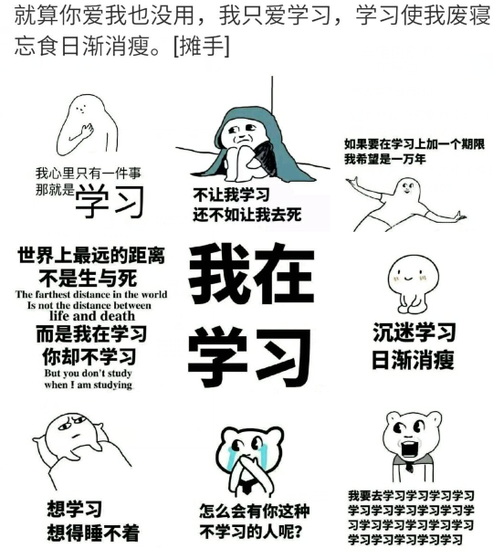
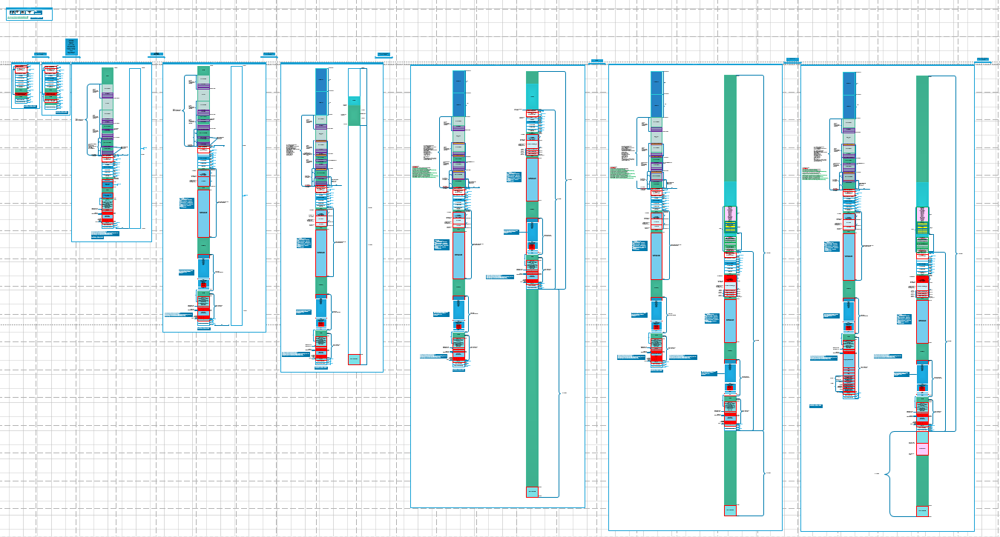
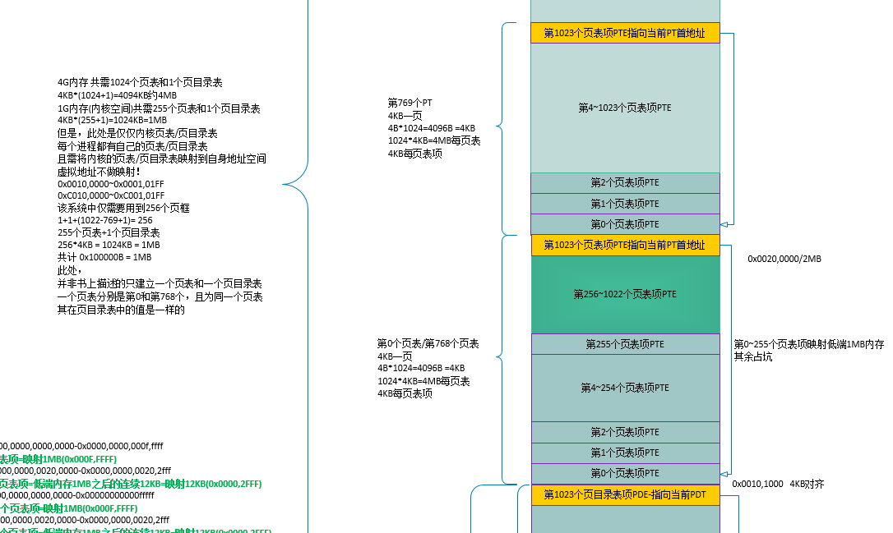
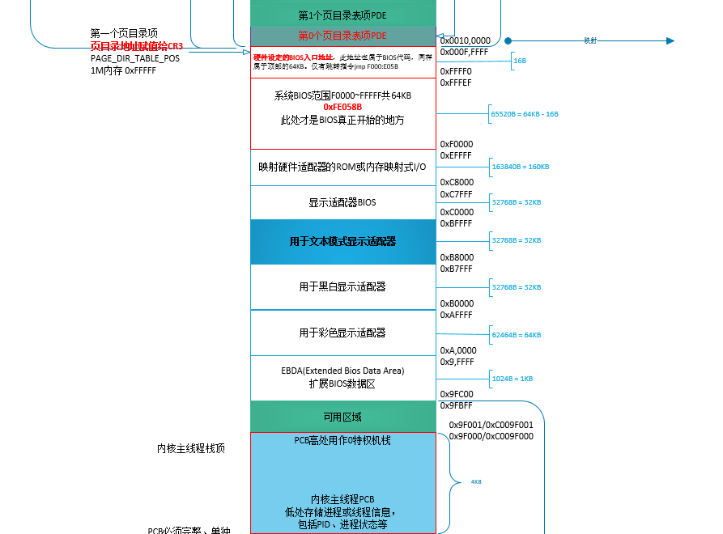

# 《操作系统真象还原》札记


<!-- TOC depthFrom:1 depthTo:6 withLinks:1 updateOnSave:1 orderedList:0 -->

- [《操作系统真象还原》札记](#操作系统真象还原札记)
	- [仓库目录介绍](#仓库目录介绍)
	- [GitBook地址](#gitbook地址)
	- [我的任务](#我的任务)
	- [visio图示](#visio图示)
	- [作者简介](#作者简介)
	- [一个中专生的奋斗，只为不负时光](#一个中专生的奋斗只为不负时光)
	- [半平米的梦想——该书背后的故事](#半平米的梦想该书背后的故事)
	- [技术道路真不好走，劝你不要再坚持了](#技术道路真不好走劝你不要再坚持了)

<!-- /TOC -->

## 仓库目录介绍

> 1. code - 各章节代码
>
> 2. code/dev - 二次开发devel
>
> 3. visio - visio图示
>
> 4. tools - 相关工具

```
Something I hope you know before go into the coding~
First, please watch or star this repo, I'll be more happy if you follow me.
Bug report, questions and discussion are welcome, you can post an issue or pull a request.
```

## 相关网址

* GitBook地址:<https://yifengyou.gitbooks.io/os-elephant/content/>
* GitHub地址:<https://github.com/yifengyou/os-elephant>

## 我的任务

> 1. 跑通每个实例，代码注释，img生成，脚本一键启动**
>
> 2. 绘制visio图**
>
> 3. 二次开发**

身为菜鸡，学习为主，希望不要因为各种锤子版权啊、装逼啥的问题找上麻烦。



## Visio图示



<br /><br />


<br /><br />



<br /><br />



<br /><br />

## 作者简介


		图右为郑刚，毕业于北京大学，前百度运维高级工程师，对操作系统有深入的研究。
		好运动，喜钻研，热衷于尝试前沿技术，乐于分享学习成果。
		该书出版于2016-3，全书759页。定价108元。

&emsp;&emsp;大学及研究生都有操作系统课程，这类人群具有很高的学术能力,但书中讲的过于抽象与晦涩，以至于很多学生对于此门课程恐惧到都提不出问题，只有会的人才能提出问题。操作系统理论书是无法让读者理解什么是操作系统的，学操作系统不能靠想像，他们需要看到具体的东西。绝大多数技术人都对操作系统怀着好奇的心，他们渴望一本告诉操作系统到底是什么的书，里面不要掺杂太多无关的管理性的东西，代码量不大且是现代操作系统雏形，他们渴望很快看到本质而不花费大量的时间成本。<br/>

## 一个中专生的奋斗，只为不负时光

&emsp;&emsp;"郑刚：我来自农村，八零后，初中时盛行农转非，读中专能包分配工作，号称国家干部的待遇。我很幸运考上了一所国家级重点中专学校，不幸的是那个学校是四年制。四年后我快毕业的时候，时代发生了很大的变化，中专已经不吃香了，我当时自己也尝试着找了很多工作。面过演员，应聘过服务员，为了证明自己身体强壮，拿着肌肉照去工厂面试，干些体力活。做了一段时间，发现还是不喜欢这样的工作，想去一家软件公司，对方要求掌握一个软件，当时我什么都不懂，就去网吧包夜学习，那时候包夜是从晚上十点开始，我八点多没事就过去在门口等着，后来跟老板熟了，他就跟我说不用等了直接去。我就在网吧学一夜，第二天昏昏沉沉的再回学校。后来面试通过了，工作内容是做测试，画一些三维机械图。这家公司的员工学历都很高，有一次我碰到一个新入职的员工，看上去比我小，我本来是出于好意问她：“你是大专吗？”当对方告诉我是硕士毕业时，我几乎是羞愤自尽。后来单位裁员，连本科生和一些研究生都被裁掉了，我一直战战兢兢，努力地去做一些没人做的工作，领导也都看在眼里。即使这样，我跟本科生做同样的工作，工资却只是人家的一半，心理多少有些不平衡。我当时的领导后来鼓励我说，“人有多大胆，地有多大产。”（这句话到现在我也经常说）所以后来我就辞职想继续学习，参加成人高考。第一年赶上非典，正好考试延期，我可以参加，结果很幸运考上了一所大学。悲剧的是，我父母创业失败了，尽管我的工资全交家里了，但还不够还债的，因此没有条件供我读书。本来考上大学是一件特别光荣、值得到处炫耀的事，我家里却无奈地没有到处宣扬，那种感受还是很欲哭无泪的。于是我跟家里说不给家交钱了，一边工作，一边继续利用业余时间复习，有了准备之后这次胆子更大，报了北大。一年的工资也攒够了学费，也幸运地考上了北大，尽管我读的是脱产成人教育，但依然觉得幸福无比。"

## 半平米的梦想——该书背后的故事

&emsp;&emsp;"当初的写作环境就是0.5平米左右大小的空间：在床和墙壁之间的夹道上放了一个黄色的小凳子当桌子，一个蓝色的更小的凳子当椅子，伸开腿就把空间占满了。当初也觉得自己挺苦逼的，因此情不自禁就拍了照片。"


>这本书是如何完成的？

&emsp;&emsp;"我是一名运维工程师，目前运维行业显得很没技术含量，我很想改变这一点。比如开发人员经常让咱们帮我装各种软件，我很不喜欢这样的工作。他怎么不喊总监或CTO帮他装呢，原因很简单，在他心里我们就是干这个的，就像想清洁地面时要喊保洁阿姨一样。说白了虽然都是干技术工作的，但他们认为运维的技术能力不如他们，我想证明他们是错的。我心目中的运维工程师至少是全栈工程师，我希望这本书能帮到运维的同事。<br>
&emsp;&emsp;这本书脱产写了19个月，之所以花了这么久，是因为传统上讲述操作系统的教材都比较枯燥，理论较多，而且很少有以实践为主题的专项书籍，大家看完此类教材后依然不会写操作系统。想学习操作系统的编写可又无从下手，但这种现象大量存在；而本书的使命是详细介绍理论，并且付诸于实践，一步步地向大家说明操作系统的编写过程和理论。因此，花费的时间必然很长。<br>
&emsp;&emsp;辞职写书压力很大，大部分会发愁生活该怎么办。不说别处了，在北京你听说过有人饿死吗？我觉得很多困难都没有人们想象的那么大，大多数困难都是借口，主要是看你想不想做这件事。我同样也有压力，我是怕万一失败了，耽误了我女朋友怎么办，因此主要压力皆来自于自己。尽管几乎所有的外人对我这翻举动都嗤之以鼻，说我多大了还不着调等等，但我真的没往心里去。有句话说只有自己所爱的人才能影响自己，我爱我女朋友，她很支持我，如今她已经成为我的老婆。生活主要是靠之前的积蓄，花销也不大，租的是一间小屋子，吃喝也花不了多少钱。"

>写给这本书的读者

&emsp;&emsp;"先说一下本书不适合哪些人吧。那些已经懂计算机开发的人是不适合的，在高手眼里，本书的内容都不算什么，因此除高手之外都适合^_^。<br>
有人觉得学习操作系统很耗精力，且并不会有直接的经济产出，好像性价比不高。但是，真正想学习操作系统的人是不会这么问的，没什么值不值得，就是想不想做，没有理由，全凭念想。就像人担心鸟总在天上飞，万一要掉下来怎么办，飞是鸟的天性，人不会飞，因此不理解。<br>
&emsp;&emsp;学习操作系统，就像跳远一样，要想跳得远，肯定要往后退两步加助跑，我们就是在助跑。操作系统是个硬功，如果把硬功学会，上层应用在我们眼里就会坦露无疑。比如人看到电线着火，在外行人眼里顶多理解到一定是短路了，而内行人看到的是：电阻小，电流高速流动，相互碰撞产生摩擦， 摩擦生热导致电线着火，理解得更深入。再看，身边总有一些大牛的同事在公司建功立业，其实很多人在进公司之前就已经很牛逼了，坦白说他们是带着牛逼的本领来公司创收的，我相信他们之前为了“修行”也捱过寂寞。修行是残酷的，大师是寂寞的，修行之后，这一切都值得。<br>
&emsp;&emsp;有人说这本书这么厚，看不完啊。书厚未必看得时间长，为什么厚？为了降低难度，本来一句话能解释清楚的我用了三句话，能不厚吗？看书的目的是把意思搞懂，虽然一句话变成了三句话，但读书的速度更快了，这不是省时间吗？<br>
&emsp;&emsp;说点题外的，有些人说公司太忙了没时间学习，甚至觉得这样的公司过于剥削，对个人发展不利。但我想说，老板不是慈善家，他花钱雇你给他干活，你拿了人家钱了还要求人家给你更多的个人时间，于情于理都说不过去，因此，学习靠挤时间。我之前在百度那阵，有一段时间经常第二天凌晨4点下班，回去睡到11点再去公司上班，对于今天上班明天下班的我来说，还能挤挤时间学习呢。学习是自己的事，想学习的人，一定会创造条件来学习。"

## 技术道路真不好走，劝你不要再坚持了

&emsp;&emsp;光看这题目，瞬间你的小宇宙就达到了第七感，一股想扁我的冲动。其实这是个误会，我想表达的是：**“技术道路不好走，你需要的不是“坚持”，而是“不放弃”**。<br>
&emsp;&emsp;坚持，听上去多么痛苦的一个词，比如在加班时很多领导都在鼓励下属：大伙儿辛苦了，再坚持一下等等...难受不？因此，但凡用坚持来鼓励的事情，都是建立在痛苦之上，在主观上一定认为其“难受”。有“放弃”才谈得上“坚持”，人是有主观情绪的，用“坚持”来“鼓励”自己，已经输了一半，自己认为痛苦的事很难干下去。<br>
&emsp;&emsp;干不下去的原因是遇到困难时头脑里有“放弃”的念头，如果头脑中没有这个念头，从来没想过半路退出，那还有什么做不到的呢？成功无非是时间长短的问题。因此做任何事之前，心里不要给自己“放弃”的心里预期，必须要干成为止。举个例子，人口渴时肯定一定要找到水为止，肯定不曾想过放弃找水。学习技术也是一样，如果技术对您来说就像水一样必不可缺时，您必然不会放弃技术，必然会成为技术大牛。也许有人说了，别装B了好嘛，道理谁都懂，大师你这么能忽悠，你自己做到了吗？其实。。。我用了19个月写《操作系统真象还原》这本书，算是“不放弃”的证明吗？有人开始嘟囔了，你说19个月就19个月啊，谁看见了。。。好吧，只有出杀手锏了。<br>
&emsp;&emsp;很多人都说减肥困难，减个肥就算励志。长肉的原理就是吃了过量的碳水化合物或脂肪或蛋白质，只要减少以上食物的摄入量人就会瘦，因此减肥的难度不大。比减肥更难的是增肥（我又要挨骂了）。啥？增肥困难？多吃就行了啊，吃还困难？要求太奢侈了吧大哥？您听我说，有一小部分人先天就是脾虚型，我就是。脾主肌肉，而思伤脾，因此常期用脑思考的人必然脾虚，脾虚则消化功能差，营养吸收有限，营养不良，因此吃的大部分都拉出去了，吃的多拉的多。。。我师傅就是典型的这类人，特别能吃但是人很瘦，瘦到什么程度呢，话说他当年拍婚纱照的时候，为了把西裤撑起来都穿了毛裤，当时可是夏天啊，哈哈，师傅，多有得罪，我还是很爱你的。我也是不容易胖，吃多少都不长肉，但我从来没想过放弃，通过无氧训练和摄入适量碳水化合物和蛋白质，三个月就有了不小的变化，其实网络上那张苦逼的IT人照片就是我。。。


&emsp;&emsp;"也许有同学说，这肌肉还算大？网上有很多比你还瘦的人练得比你还大。和大伙儿解释一下，瘦型人是最不容易长肌肉的，您想，平时那么瘦，身体说变就变得那么极端，这在自然的情况下是不可能的。如果一个瘦型人能练到超大的肌肉块，肯定是注射了类固醇或者睾丸酮。专业的健美运动员为了打比赛，没有不注射这些的。"<br>
&emsp;&emsp;**总之坚持是痛苦的，要想成功，脑子中就必须没有“放弃”这个概念。**
