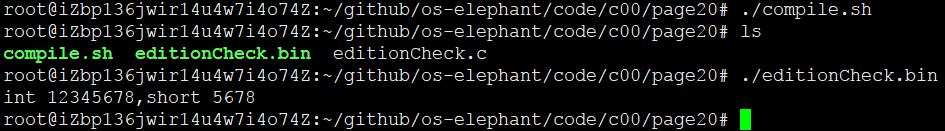
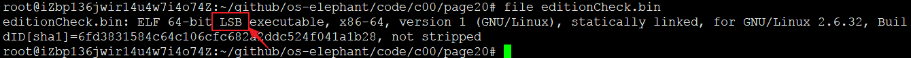

# 大端小端

计算机业界，端表示数据在存储器中的存放顺序。大端与小端是两种数据的存储方式！

大端方式将高位存放在低地址，小端方式将高位存放在高地址。

通常，一个芯片的管脚中，对于一个多比特的信号，比如32根的地址线，从低开始按0到31编个号。MSB就是31，LSB就是0。那么如果标记为：ADDR[31:0]就是MSB   first的方式，如果标记为ADDR[0:31]就是LSB   first的方式。

## 大端

      高位在低地址，低位在高地址

## 小端

      低位在低地址，高位在高地址

## 程序运行

      通过file命令读取ELF程序头信息
      LSB (Least Significant Bit)是“最低有效位”。
      MSB (Most Significant Bit)是“最高有效位”。
      LSB和MSB是以机器码为单位进行排序。

汇编中，比如8位2进制数10000001，其中第一个1是MSB,第二个1是LSB。在计算机计算的时候用于判断的比如如果是整数那么小数点（实际上是没有小数点的，但就把那一位和下一位之间看作有）在LSB后面，如果是小数小数点在MSB后面，其中MSB在有符号数中又是符号位。

## 总结

      不同硬件设计方案带来了不同的数据存储方式。
      网络字节序就是大端序
      Intel的80x86系列芯片是唯一还在坚持使用小端的芯片
      ARM芯片默认采用小端，但可以切换为大端
      MIPS等芯片要么采用全部大端的方式储存，要么提供选项支持大端——可以在大小端之间切换
      Java是平台无关的，默认是大端
      C语言中，默认是小端（但在一些对于单片机的实现中却是基于大端，比如Keil 51C）
